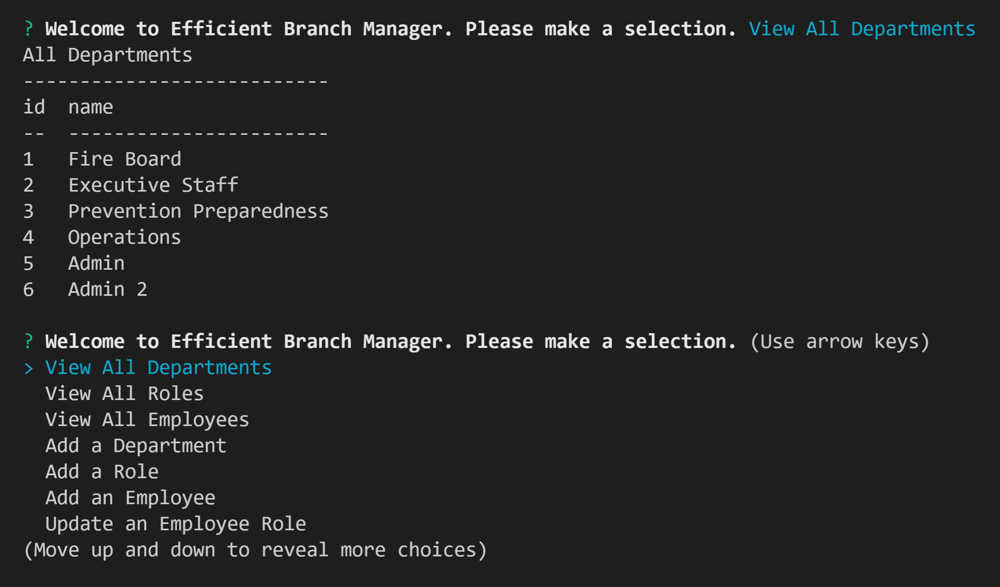

# The Efficient Branch Manager
## Organize your business with MySQL locally

### About
This node.js application helps you organize your business by creating a log of all your Departments, Employees, their salaries, their manager, and their company roles. 

The log is organized in MySql database tables. Use your command line terminal to view, add, update and delete entries. No internet required after inital files download.

### Requirements
1. Local MySQL Server
2. Command Line Interface like Git Bash or VS Code
3. NPM inquirer
4. NPM console.table
5. NPM mysql2

### Technologies Used
* MySQL
* Inquirer
* Node.js

### Installation
This app requires a MySQL server on your computer. If you don't have it, follow this guide from UC Berkeley Extension Full Stack Coding Bootcamp: https://coding-boot-camp.github.io/full-stack/mysql/mysql-installation-guide

Set your MySQL password to 'password'. 
You will need a database called 'business'.

NOTE! If you want to use a different password or database name, just update the name and password you are using in /db/connection.js

Otherwise follow these commands one line at a time in your terminal to create the database. When prompted to enter your password enter 'password'.

    mysql -u root -p

    CREATE DATABASE business

    quit

Next download or clone the app files from this link:
https://github.com/robyng/efficient-branch-manager 

Go to your terminal and cd into the root of the app file. 
Write these commands one line at a time to download node modules and then install all dependencies including console.table, inquirer, and mysql2.

    npm init -y
    
    npm intall

### Usage

To start the program use this command:

    node index

Watch this walkthrough showing how the program can be used:
https://watch.screencastify.com/v/bdJeEYdQTpxNwX5QFSZ3

### Credits

Seed data structure for demo is from Central County Fire of San Mateo County: 
https://ccfd.org/about-ccfd/organization-chart/

Seed salaries and employees from 2019 Transparent California:
https://transparentcalifornia.com/salaries/2019/central-county-fire-department/
